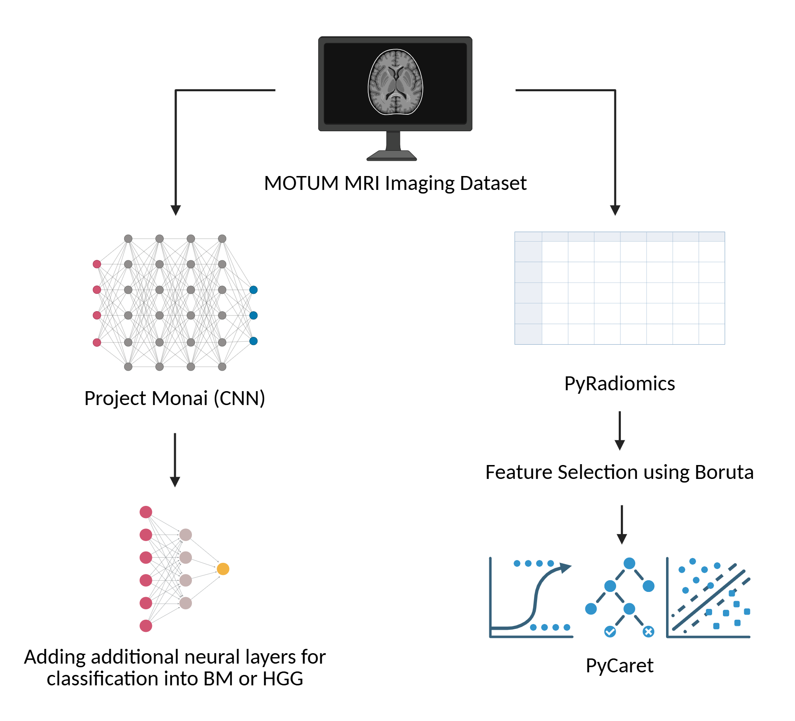
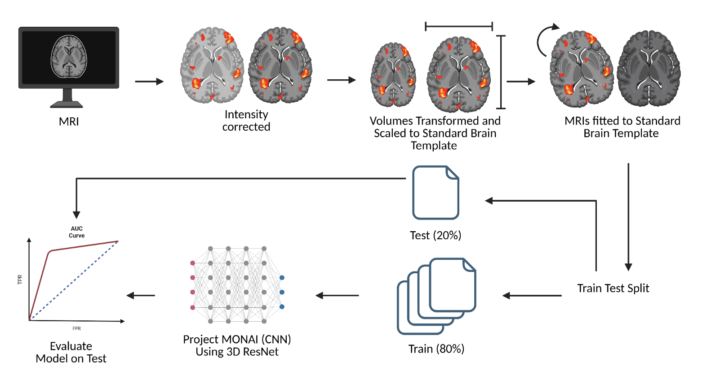

# DS9000 group project

## Group members
Boris Ngassam, Paula Magbor, Richard Zhang, Yixiu He, Rachel Barboza

## Dataset:
https://dataverse.harvard.edu/dataset.xhtml?persistentId=doi:10.7910/DVN/KUUEWC

https://gin.g-node.org/hongweilibran/motum

This MOTUM DATASET contains MRI images from 67 patients diagnosed with aggressive malignant brain tumours. These tumours are categorized into two types: high grade gliomas (HGG) and brain metastases (BM). 

## Reference:
Gong, Z. et al. A Multi-Center, Multi-Parametric MRI Dataset of Primary and Secondary Brain Tumors. Sci Data 11, 789 (2024).

## Project summary:
Distinguishing high-grade gliomas (HGGs) from brain metastases (BMs) is a clinical challenge, as both tumor types possess similar MRI characteristics. Machine Learning (ML) approaches offer a non-invasive method of differentiation, but few studies directly compare radiomics-based classification models with deep learning approaches. In this study, we used the MOTUM dataset, consisting of multisequence MRI scans and radiomic features. We aim to evaluate the relative performance of traditional ML models using radiomics data compared to deep learning approaches trained directly on MRI images. Radiomics feature selection was conducted using correlation metrics and Boruta algorithm, followed by training and hyperparameter optimization using PyCaret.

## Workflow:

  
  
  

